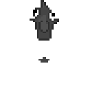

### Hi! 👋 I'm Andrei and I work on computer vision for autonomous robots. 🤖

Check out my website [here](andreibarsan.github.io), or some of the projects that I've worked on below! ⬇️

Recently, I've been working on [simultaneous localization and mapping (SLAM) for multi-camera robots](https://arxiv.org/abs/2101.06562) and on [exploring how to jointly perform efficient multi-task learning for self-driving cars](https://arxiv.org/abs/2101.06720)! 

My [website](andreibarsan.github.io) and [Google Scholar Page](https://scholar.google.com/citations?hl=en&user=nOj2GykAAAAJ) have more detailed lists of my current and past work!

<!--  a bit too distracting :/ -->
<!--
**AndreiBarsan/andreibarsan** is a ✨ _special_ ✨ repository because its `README.md` (this file) appears on your GitHub profile.

Here are some ideas to get you started:

- 🔭 I’m currently working on ...
- 🌱 I’m currently learning ...
- 👯 I’m looking to collaborate on ...
- 🤔 I’m looking for help with ...
- 💬 Ask me about ...
- 📫 How to reach me: ...
- 😄 Pronouns: ...
- ⚡ Fun fact: ...
-->
